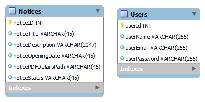

# ComsentimentoAPI
API para comunicação com front

## Como executar
- Clone o projeto para um repositório local 
- Execute `npm i run start` para instalar as dependências.
- Após finalizar a instalação execute `npm run` para fazer o servidor executar
- - É necessário disponibilizar a porta 3003 para a aplicação
- É necessário criar um banco MYSQL ou fazer acesso a um já criado com os seguintes dados
    - DB_HOST = IP
    - DB_USER = Usuário do banco
    - DB_PASSWORD = senha do banco
    - DB_SCHEMA = nome da base
    - PORT = 3003
    - JWT_KEY = A necessaria
    - BCRYPT_COST = 12

- Pronto, a API está pronta para ouvir as requisições 

## Documentação
https://documenter.getpostman.com/view/20306176/Uz5NjZ3Z

## Prints do projeto
### Modelo do banco
